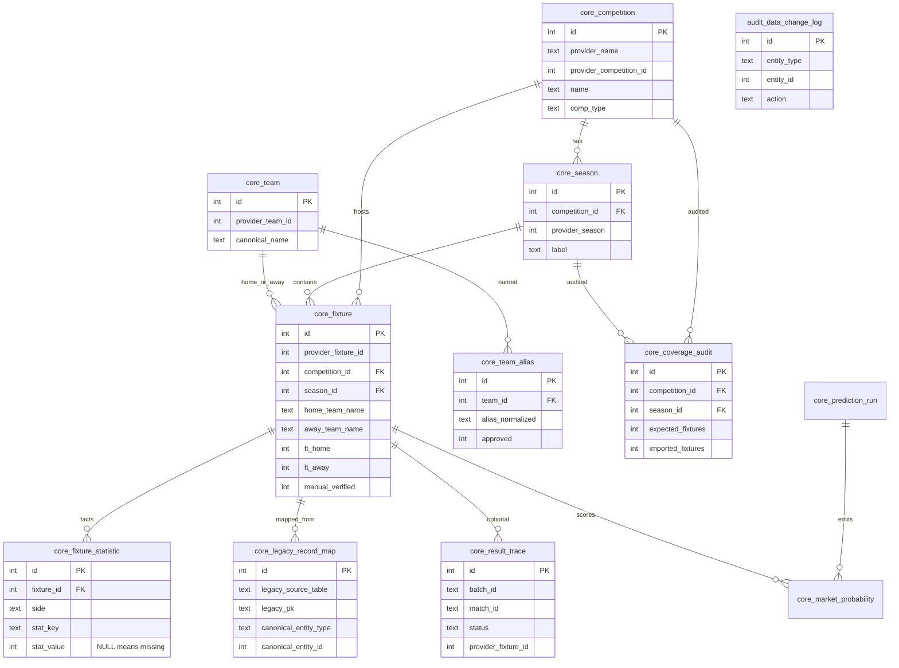

# Core database ERD (additive layer)

Legacy `hist_*` / `live_*` / `bet_*` / KV batches remain authoritative. This diagram covers new `core_*` / `analytics_*` / `audit_*` objects only.

View `analytics_v_fixture_compat` projects `core_fixture` + home/away corner stats for shadow compares. It never replaces a legacy table.
